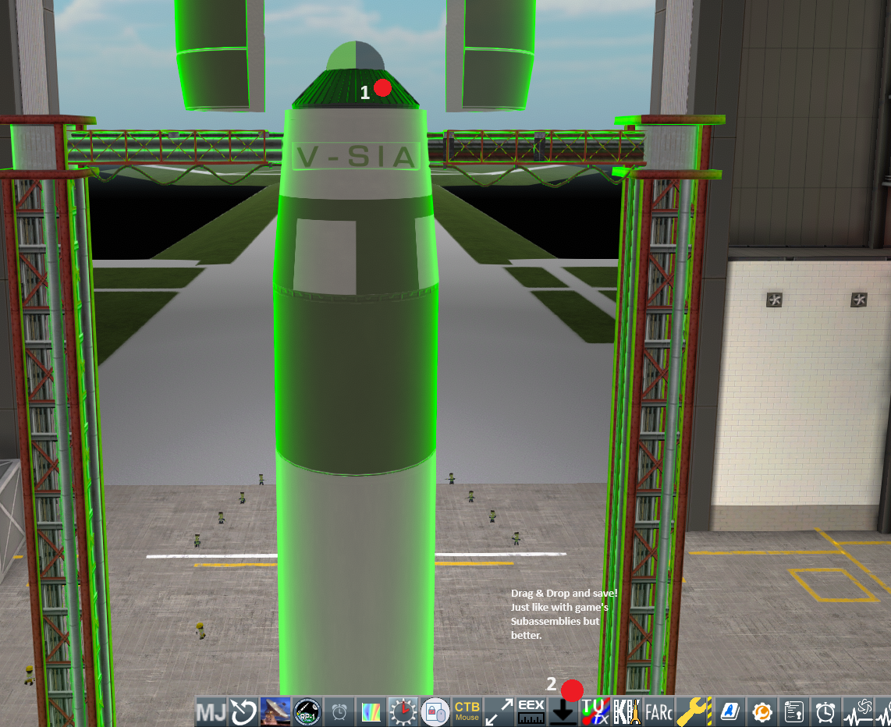
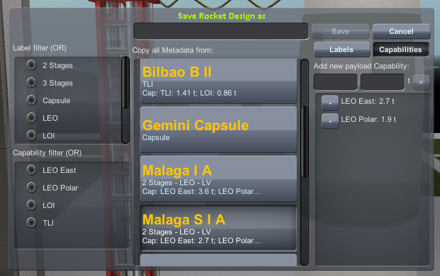
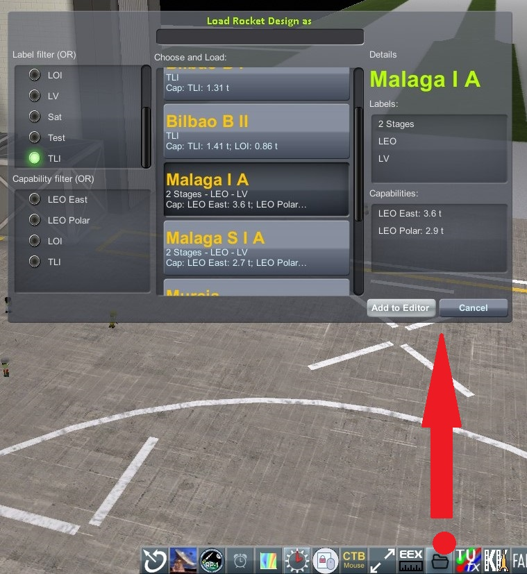

# BetterRocketDesigns

Create and manage your own Rocket Design for Kerbal Space Program. Label them and include capacilities. Drag & drop saving capabilities, just like stock subassemblies.

## Features

* Save your your designs using Drag & Drop in the save-icon.
* Load and filter by labels and by capabilities.
* Very similar and faster mechanics than stock Subassemblies.
* Fully compatible with stock KSP and major overhauls such as RP-1.

## Screenshots

## Installation steps

1. Download latest release .zip.
2. Unzip.
3. Move the BetterRocketDesign folder into your `<Game_Root_dir>/GameData/`.
4. Profit!

## License

[GNU LGPLv3](./LICENSE).